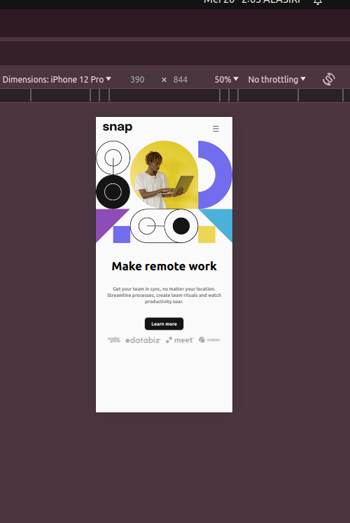
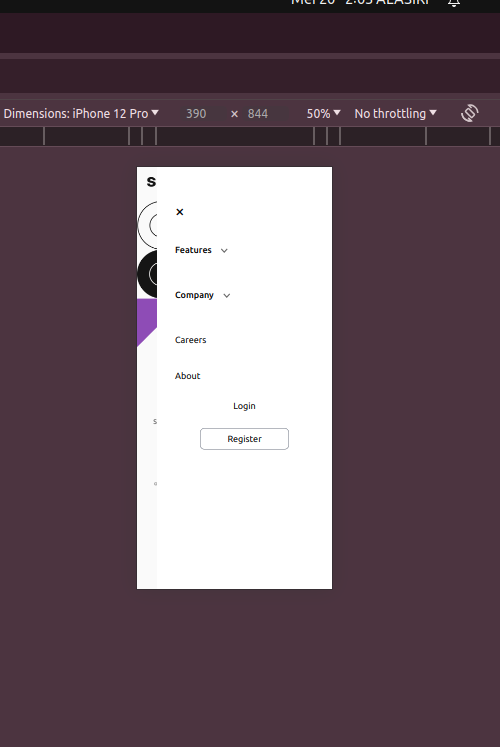
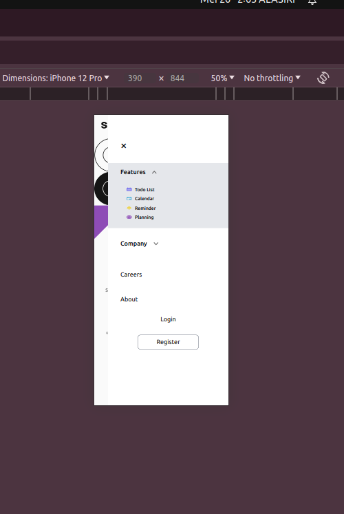
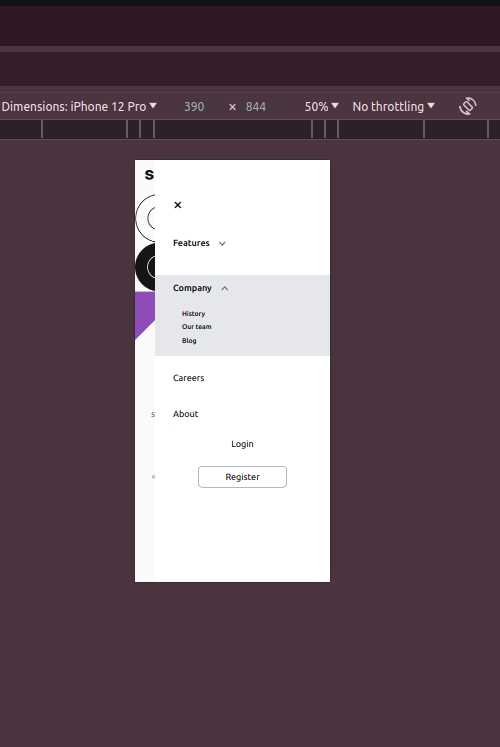
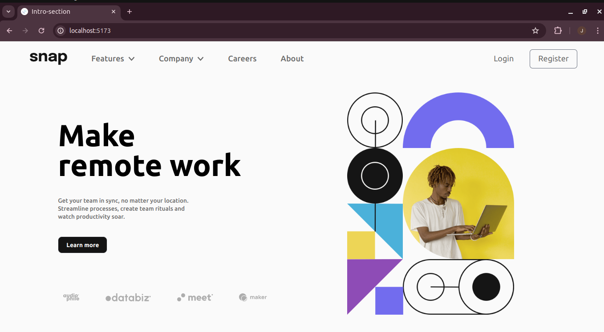
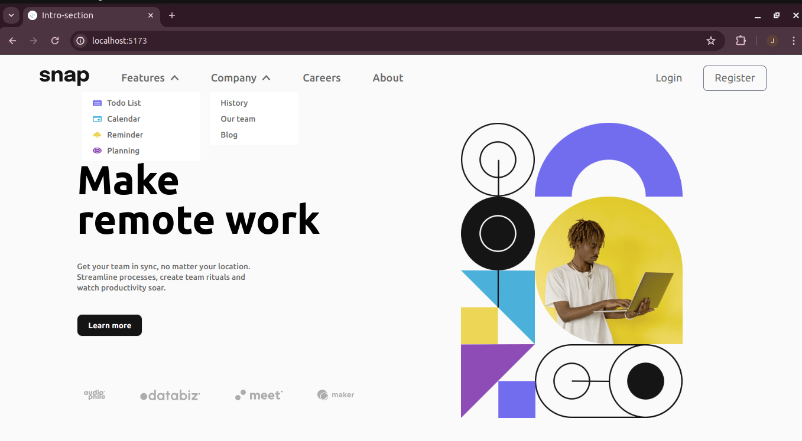
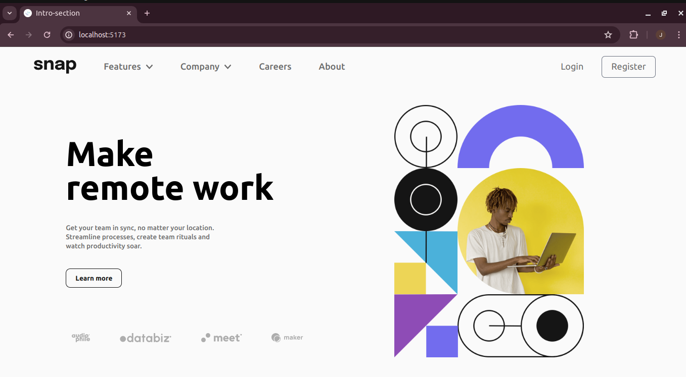

# Frontend Mentor - Intro section with dropdown navigation solution

This is a solution to the [Intro section with dropdown navigation challenge on Frontend Mentor](https://www.frontendmentor.io/challenges/intro-section-with-dropdown-navigation-ryaPetHE5). Frontend Mentor challenges help you improve your coding skills by building realistic projects. 

## Table of contents

- [Overview](#overview)
  - [The challenge](#the-challenge)
  - [Screenshot](#screenshot)
  - [Links](#links)
- [My process](#my-process)
  - [Built with](#built-with)
- [Author](#author)

## Overview

### The challenge

Users should be able to:

- View the relevant dropdown menus on desktop and mobile when interacting with the navigation links
- View the optimal layout for the content depending on their device's screen size
- See hover states for all interactive elements on the page

### Screenshot

### Links

- Solution URL: [https://github.com/njeruthuo/Introsection-with-dropdown-navigation](https://github.com/njeruthuo/Introsection-with-dropdown-navigation)
- Live Site URL: [https://introsection-with-dropdown-navigation-kohl.vercel.app/](https://introsection-with-dropdown-navigation-kohl.vercel.app/)

### Built with

- CSS Grid
- Flexbox
- TailwindCSS
- CSS custom properties
- Semantic HTML5 markup
- Mobile-first workflow
- [React](https://reactjs.org/) - JS library

### Continued development

I believe that I am done with this project unless you have a proposal for improvement.

## Author

- Website - [https://frontend-mentor-amber.vercel.app/](https://frontend-mentor-amber.vercel.app/)
- Frontend Mentor - [@njeruthuo](https://www.frontendmentor.io/profile/njeruthuo)
- Twitter - [@njeru19_njeru](https://www.twitter.com/yourusername)